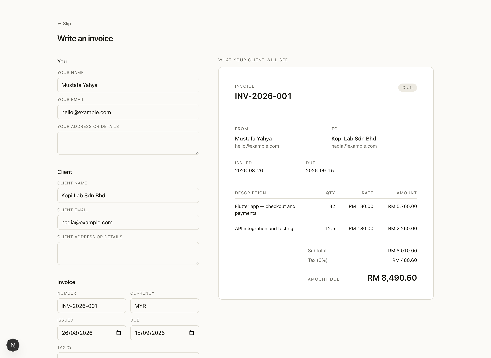
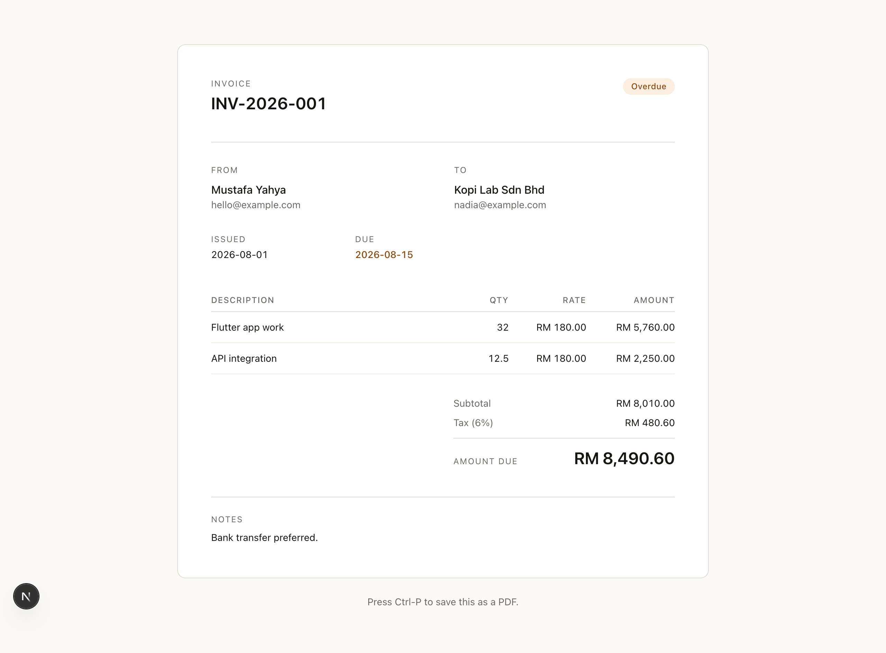
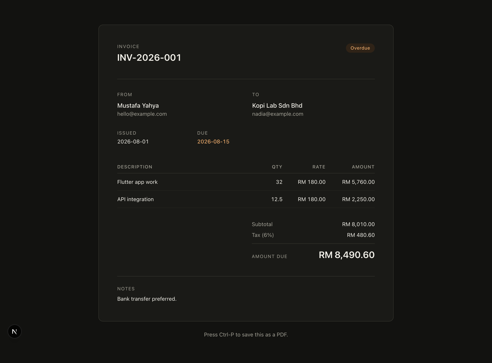

# Slip

[](https://github.com/Mustafa0u0/slip/actions/workflows/ci.yaml)

Write an invoice, send a link. No account, no password, no monthly fee for
something you do six times a month.

Next.js 16, Postgres, TypeScript.



The form is on the left and the document your client will open is on the right,
rendered from the same component, updating as you type.

<p>
  
  
</p>

## Running it

```bash
createdb slip
npm install
npm run db          # applies db/schema.sql
npm run dev
```

Set `DATABASE_URL` if your Postgres is not on `localhost:5432/slip`.

## How it works

You fill in a form and get **two links**:

- a **public** one to send your client
- a **private** one that also lets you change the status

That is the entire authorisation model. Holding the URL is what grants access —
a capability link.

It is a real trade, made deliberately. It removes passwords, sessions, resets
and the whole account surface from a tool used a handful of times a month. It
also means anyone who obtains the link has the same access, and links leak
through forwarded email, shared screens and browser history. For a document you
are about to email to the client anyway, that is a fair exchange. It would not
be for medical records.

Tokens are 160 bits from a CSPRNG, so guessing one is not a threat model worth
discussing. Invoice pages are served `noindex` — a private document on a public
URL should at least stay out of a search index.

## Money never touches a float

Every amount is an integer in minor units — sen, cents. Quantities are
thousandths, so 1.5 hours is `1500`. Tax rates are basis points, so 6% is `600`.

A float cannot represent 0.1 exactly, so a total assembled from floating point
line items drifts. On one invoice the drift is invisible; across a year of them
it is the discrepancy an accountant finds and nobody can explain. There is a
test for exactly this: a hundred lines at 0.07 sum to **exactly** 700 sen,
where the float version gives 7.000000000000001.

Rounding happens once, in one place, and rounds **half away from zero** rather
than using `Math.round`. `Math.round(-0.5)` is `-0` and `Math.round(0.5)` is
`1` — an asymmetry that only ever shows up on a credit note, which is the worst
possible time to find it.

Tax is taken on the rounded subtotal rather than per line and summed. Both are
defensible and they disagree by a unit or two; this one matches the figure a
client gets when they check the invoice with a calculator, and an invoice that
fails that check costs a phone call.

## The preview is the invoice

The builder renders the same `InvoiceDocument` component the client will open,
from the same state, on every keystroke. It is not a lookalike.

That is why the pure types live in `lib/types.ts`, apart from the `server-only`
database module in `lib/invoice.ts` — the preview runs in the browser, so
everything it needs has to be importable there. A preview that can drift from
the real document is worse than no preview, because it gets trusted.

## It prints

The public page is the deliverable, and the first thing a client does with it is
press Ctrl-P. There is a real `@media print` block that drops every control and
forces the light palette — a dark invoice wastes a cartridge and looks like a
mistake.

## Overdue is derived

Never stored. A stored flag needs something to flip it, and whatever that is
will be down on the day it matters. A date comparison cannot go stale.

Status is also shown as a **word**, not a colour alone. Roughly one man in
twelve cannot reliably separate the green from the amber, and "is this paid?"
is the entire question the page exists to answer.

## Layout

```
app/
  page.tsx              landing
  new/                  the builder
  example/              a worked example, rendered by the real component
  i/[token]/            the public invoice
  i/[token]/manage/     status, and the two links
  api/invoices/         create
components/
  invoice-document.tsx  the document itself
  builder.tsx           the form and its live preview
lib/
  money.ts              integers, and the one place rounding happens
  types.ts              the shape, importable from the browser
  invoice.ts            server-only data access
  tokens.ts             capability URLs, and what they cost
db/schema.sql
```

Validation runs in the route handler as well as the form. The browser check is
a courtesy to the person typing; the server one is the actual guarantee,
because the endpoint is reachable without ever loading the form.

## Tests

```bash
npm test
```

Seven tests over the money arithmetic — line rounding, fractional quantities,
half-away-from-zero in both directions, tax on the subtotal, and the drift test
above.

## Licence

MIT
